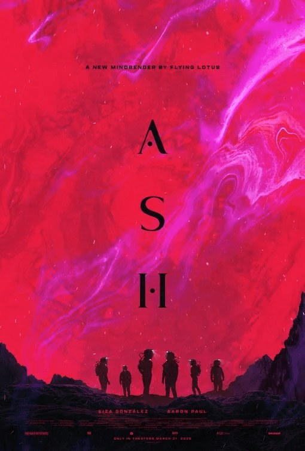

# FMX 2026 — Kitsu booth slideshow

Single-file HTML slideshow that loops on the booth screen at FMX (Stuttgart, May 5-7, 2026). CGWire shows it between live demos of Kitsu (open-source production tracking for animation and VFX studios).

## Files

- `index.html` — the whole slideshow. CSS and JS are inline. No build, no framework, no npm.
- `assets/` — image assets referenced by the slideshow. Most are placeholders to be replaced.
- `fmx-2025.pdf` — last year's deck, used as visual reference. Do not ship.

## How it runs

Open `index.html` in Chrome or Firefox. Press `F` for fullscreen.

- Auto-advances every 8 seconds, loops forever
- 700ms crossfade between slides
- Thin green progress bar at the bottom
- Keyboard: `F` fullscreen, `Space` pause, `←` / `→` navigate, `Home` restart

## Slide order (11 slides)

1. Logo + tagline "Production Tracking for Animation & VFX"
2. "Productions are getting more complex" — 2x2 grid (Tighter budgets / Shorter deadlines / Remote teams / Multi-studio projects)
3. "One place for your whole production" — UI screenshot
4. "What Kitsu brings to your studio" — 3 columns Review / Track / Connect
5. "Built for everyone in your studio" — hexagon with 6 stakeholders around the Kitsu mark
6. "Multi-studio collaboration, built in" — 3 hexagons (Studio 1, Studio 2, Producer) meeting at the Kitsu mark
7. Numbers — 400+ studios / 30 countries / 20 000+ users
8. Client logos — 4x3 grid
9. Film/series posters — 4 in a row
10. "What's new in Kitsu" — Budget Management / Smart Schedule Assignment / Playlist Improvements
11. Contact — "Come talk to us!" + QR + kitsu.cg-wire.com + Booth 1.4

## Visual conventions

- Background `#2D2D2D`, text white, accent `#22D160` (CGWire green)
- Font: Inter (Google Fonts), weights 300-700
- Large, centered text, lots of whitespace
- No bullet points
- No em dashes (use commas or periods)
- Never mention competitors (Flow, ftrack, AYON, ShotGrid)
- "Open source" can appear but is not central in this booth context
- Tone: factual and confident, not aggressive

## Asset placeholder pattern

For any image that may not exist yet, the markup is:

```html
<div class="poster" data-name="Poster 01">
  
</div>
```

If the image is missing, `onerror` removes the `` and the styled placeholder behind it (with `data-name` text) shows through. Drop the file at the right path and it just appears, no HTML edit needed.

## Assets expected in `./assets/`

- `kitsu-logo.svg` — currently inlined as approximate SVG in the HTML. To use the real one, replace each `<svg class="kitsu-mark">…</svg>` block with ``.
- `screenshot-ui.png` — Kitsu interface screenshot (16:9 ideal)
- `logo-client-01.png` … `logo-client-12.png` — client studio logos (any aspect, get inverted to white via CSS filter)
- `poster-01.jpg` … `poster-04.jpg` — film/series posters (portrait, 2:3 ideal)
- `qr-code.png` — QR pointing to kitsu.cg-wire.com or a cloud trial form

## SVG diagrams (slides 5 & 6)

Both diagrams are SVG inline, no asset needed. The hexagons are written with raw point coordinates; if you need to resize or reposition labels, edit the `viewBox` and `<text>` x/y directly.

The Kitsu wolf mark is duplicated in slides 1, 5, 6, 11 as inline SVG. If the real `kitsu-logo.svg` becomes available, swap all four occurrences.

## What is NOT in scope

- Mobile / responsive (booth screen is 1920x1080+ landscape only)
- Localization (English only)
- Analytics, tracking, anything network beyond Google Fonts
- Build tooling
